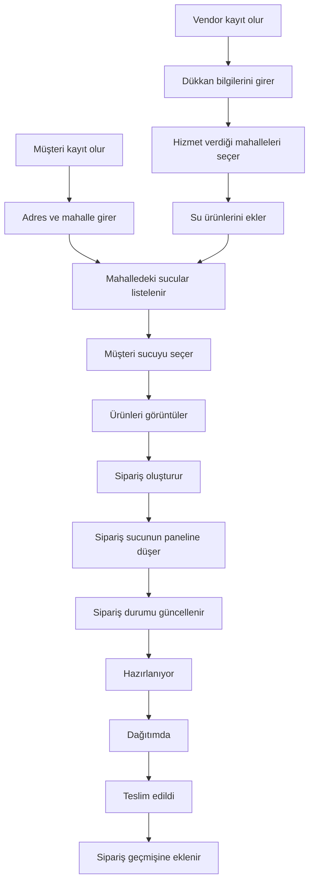

# Sucu — Mahalle Bazlı Su Sipariş Platformu

> 📱 **App Store:** _yayın süreci devam ediyor_ · 🧪 **TestFlight:** build alındıktan sonra davet linki eklenecek

## İçindekiler

- [Nasıl çalıştırılır](#nasıl-çalıştırılır)
- [Mimari özet](#mimari-özet)
- [Klasör yapısı](#klasör-yapısı)
- [Veri modeli](#veri-modeli)
- [AI kullanımı](#ai-kullanımı)
- [Proje fikri ve detayları](#problem-tanımı)

## Nasıl çalıştırılır

Gereksinimler: Node.js 20+, npm, (iOS için) macOS + Xcode veya bir iPhone + Expo Go/dev client.

```bash
# 1. Bağımlılıkları kur
npm install --legacy-peer-deps

# 2. Dev sunucusu başlat
npx expo start
```

`.env` dosyası repo içinde (Supabase URL + publishable key). Her iki değer **public'tir** — Supabase tasarımı gereği client'ta bulunurlar ve güvenlik Row Level Security (RLS) katmanıyla sağlanır. Kendi Supabase projenizi kullanmak isterseniz `.env.local` oluşturup değerleri override edebilirsiniz.

### Demo kullanıcı

App Store submission hazır olduğunda hocaya iletilecek olan hazır test hesapları:

- Müşteri: `customer@sucu.app` / `sucutest`
- Sucu: `vendor@sucu.app` / `sucutest`

---

## Mimari özet

| Katman | Teknoloji |
|---|---|
| Mobil uygulama | Expo SDK 54, React Native 0.81, TypeScript, Expo Router |
| Stil | NativeWind (Tailwind RN) |
| State | TanStack Query (server state) + React Context (auth) |
| Backend | Supabase — Postgres (+ RLS), Auth, Storage, Edge Functions |
| Push | Expo Push API + Supabase Edge Function |
| Build/Deploy | EAS Build + EAS Submit (iOS App Store) |

### Güvenlik katmanı

- Her tabloda RLS açık, her sorgu `*_active` view'ları üstünden çalışır (soft delete disiplini)
- `auth.uid()` + tablo FK'leri ile sahip-tabanlı policy'ler
- Storage bucket'larında path konvansiyonu `{vendor_id}/...` — policy bu yola göre yetki verir
- Repo public olduğu için: service_role key, Apple sertifikası, EAS token repo'ya **girmez**; sadece Supabase URL + publishable key commit edilir (tasarım gereği public)

## Klasör yapısı

```
app/                       # Expo Router ekranları
  _layout.tsx              # Root (QueryClient + AuthProvider + Stack)
  index.tsx                # Oturum durumuna göre yönlendirme
  (auth)/                  # role-select, login, signup
  (customer)/              # Müşteri akışları
    index.tsx              # Home: sucu listesi
    addresses.tsx          # Adres listesi
    address-edit.tsx       # Adres ekle/düzenle
    profile.tsx            # Profil menüsü
    orders.tsx             # Sipariş listesi
    order/[id].tsx         # Sipariş detay + review
    vendor/[id].tsx        # Sucu detay + ürünler + sipariş modal'ı
  (vendor)/                # Sucu akışları
    index.tsx              # Home: bugünkü siparişler
    shop.tsx               # Dükkan ayarları (saat, teslim ücreti, telefon)
    service-areas.tsx      # Hizmet verilen mahalleler
    products/              # Ürün CRUD + fotoğraf upload
    orders.tsx             # Tüm siparişler
    order/[id].tsx         # Sipariş detay + status güncelleme
    profile.tsx
components/
  NeighborhoodPicker.tsx   # İstanbul mahallesi için arama+seç component'i
lib/
  supabase.ts              # Supabase client (AsyncStorage persistence)
  auth.tsx                 # AuthProvider + useAuth
  notifications.ts         # Expo push token kayıt yardımcısı
  orderEvents.ts           # Sipariş olaylarını Edge Function'a iletir
  format.ts                # TL ve sipariş status formatlaması
  queries.ts               # TanStack Query cache key'leri
types/
  database.ts              # Supabase'den üretilmiş TypeScript tipleri
supabase/
  seeds/
    istanbul_neighborhoods.sql   # 961 mahalle seed
scripts/
  build_istanbul_seed.mjs        # Seed üretim script'i
docs/
  plan.md                  # Proje planı ve kararlar
  prompt-log.md            # Claude Code'a gönderilen promptların otomatik logu
supabase/                  # Edge Function'lar Supabase üzerinde deploy edilmiş
```

## Veri modeli

10 tablo + 9 `_active` view. Her tabloda ortak base kolonlar: `id`, `created_at`, `updated_at`, `deleted_at`.

- **profiles** — auth.users ile 1:1 (role: customer / vendor)
- **districts, neighborhoods** — Istanbul lookup (39 ilçe, 961 mahalle)
- **vendors** — dükkan bilgisi, teslim ücreti, çalışma saatleri
- **vendor_service_areas** — sucunun hizmet ettiği mahalleler (N:M)
- **products** — sattığı ürünler, fotoğraf path'i
- **customer_addresses** — müşteri adresleri
- **orders** — sipariş (v1: tek ürün × N adet, sepet yok)
- **order_status_history** — append-only durum log'u
- **reviews** — 1-5 yıldız + opsiyonel yorum, siparişe tek review

Detaylı veri modeli, RLS politikaları ve karar gerekçeleri için: [docs/plan.md](docs/plan.md)

## AI kullanımı

Bu proje, **Claude Code** ile iteratif bir şekilde geliştirildi. Planlama (docs/plan.md), veri modeli tasarımı, şema migration'ları, uygulama kodu, Edge Function, Istanbul mahalle verisi toplama — hepsi AI destekli yürütüldü. Geliştirme sürecinde Claude Code'a gönderilen promptların tümü **otomatik olarak** [docs/prompt-log.md](docs/prompt-log.md) dosyasına kaydedildi (bir UserPromptSubmit hook'u üzerinden).

Kullanılan diğer araçlar:
- **Supabase MCP server** — Claude'dan doğrudan DB migration + edge function deploy
- **bertugfahriozer/il_ilce_mahalle** açık veri seti — Istanbul mahalle seed kaynağı

---


## Problem Tanımı

Günümüzde birçok mahallede su siparişi hâlâ telefonla veya mesaj yoluyla
verilmektedir. Bu durum çeşitli problemlere yol açmaktadır:

-   Müşteriler mahallelerinde hizmet veren su bayilerini kolayca
    bulamamaktadır.
-   Sipariş süreci çoğu zaman telefon üzerinden yürütüldüğü için sipariş
    geçmişi takip edilememektedir.
-   Sipariş durumunun hangi aşamada olduğu (hazırlanıyor, dağıtımda vb.)
    kullanıcı tarafından görülememektedir.
-   Su bayileri siparişleri çoğu zaman manuel olarak takip etmek zorunda
    kalmaktadır.

Bu nedenle hem müşteriler hem de su bayileri için sipariş sürecini
dijitalleştiren basit bir platforma ihtiyaç vardır.

## Hedef Kullanıcı Kitlesi

Proje iki farklı kullanıcı grubuna yöneliktir.

### 1. Müşteriler

-   Mahallesindeki su bayilerinden hızlı şekilde sipariş vermek isteyen
    kullanıcılar
-   Telefonla sipariş vermek yerine dijital olarak sipariş oluşturmak
    isteyen kişiler
-   Sipariş geçmişini görmek ve sipariş durumunu takip etmek isteyen
    kullanıcılar

### 2. Su Bayileri (Sucu)

-   Mahalle bazlı hizmet veren yerel su satıcıları
-   Siparişlerini dijital ortamda yönetmek isteyen küçük işletmeler
-   Hangi siparişlerin hazırlanması veya dağıtımda olduğunu görmek
    isteyen işletmeler

## Değer Önerisi

Sucu uygulaması, müşteriler ile mahalle bazlı hizmet veren su bayilerini
tek bir platformda buluşturur.

Uygulama sayesinde:

-   Kullanıcılar kendi mahallelerinde hizmet veren su bayilerini
    görebilir.
-   Su bayilerinin sunduğu ürünler listelenebilir.
-   Kullanıcılar hızlı şekilde sipariş oluşturabilir.
-   Siparişin hangi aşamada olduğu uygulama üzerinden takip edilebilir.
-   Kullanıcılar geçmiş siparişlerini görüntüleyebilir.

Bu sayede hem müşteri tarafında sipariş süreci kolaylaşır hem de su
bayileri siparişlerini daha düzenli şekilde yönetebilir.

## Minimum Viable Product (MVP) Özellikleri

İlk versiyonda uygulamanın aşağıdaki temel özellikleri bulunacaktır.

### Kullanıcı özellikleri

-   kullanıcı kaydı ve giriş
-   adres ekleme
-   mahallede hizmet veren su bayilerini listeleme
-   ürünleri görüntüleme
-   sipariş oluşturma
-   sipariş durumunu takip etme
-   sipariş geçmişini görüntüleme

### Su bayisi özellikleri

-   su bayisi kaydı
-   hizmet verilen mahalleleri tanımlama
-   satılan su ürünlerini ekleme
-   gelen siparişleri görüntüleme
-   sipariş durumunu güncelleme

## Kullanıcı Yolculuğu (User Journey)

Uygulama iki farklı kullanıcı türüne hizmet etmektedir: **su bayileri
(sucu)** ve **müşteriler**.

### Su Bayisi (Vendor) Kullanıcı Yolculuğu

1.  Su bayisi uygulamaya kayıt olur.
2.  Dükkan adı ve iletişim bilgilerini girer.
3.  Hizmet verdiği şehir, ilçe ve mahalleleri seçer.
4.  Satışını yaptığı su ürünlerini sisteme ekler (marka, hacim, fiyat
    vb.).
5.  Müşterilerden gelen siparişleri uygulama üzerinden görüntüler.
6.  Sipariş durumunu güncelleyebilir (hazırlanıyor, dağıtımda, teslim
    edildi vb.).
7.  Tamamlanan siparişleri sipariş geçmişi üzerinden görüntüleyebilir.

### Müşteri (Customer) Kullanıcı Yolculuğu

1.  Kullanıcı uygulamaya kayıt olur.
2.  Adres ve mahalle bilgisini ekler.
3.  Sistem kullanıcının mahallesinde hizmet veren su bayilerini
    listeler.
4.  Kullanıcı bir su bayisini seçer ve ürünleri görüntüler.
5.  Kullanıcı sipariş oluşturur.
6.  Sipariş durumu uygulama üzerinden takip edilir.
7.  Kullanıcı daha sonra sipariş geçmişini görüntüleyebilir.

## Sistem Akış Diyagramı



## Kullanılacak Yapay Zekâ Araçları

Projenin geliştirme sürecinde çeşitli yapay zekâ araçları
kullanılacaktır:

-   **ChatGPT / Claude:** proje konsepti, kullanıcı yolculuğu ve teknik
    tasarım üretimi
-   **AI tabanlı UI araçları (ör. v0, Midjourney vb.):** uygulama
    ekranlarının tasarlanması
-   **AI kod üretim araçları:** prototip uygulama geliştirme sürecinde
    destek

Bu araçlar fikir geliştirme, tasarım ve prototipleme aşamalarında üretim
ortağı olarak kullanılacaktır.
